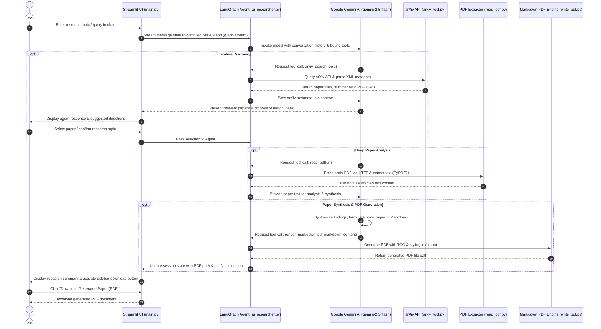

# AI-Researcher 📄
AI-Researcher is an autonomous, agentic framework built with LangChain and LangGraph that automates the lifecycle of academic research. The platform allows users to explore specific topics, analyze recent literature from arXiv, and synthesize findings into professional, LaTeX-formatted research papers.

## 🚀 Features
Autonomous Research Agent: A ReAct-based agent that uses reasoning and acting loops to search, read, and write research autonomously.

Literature Discovery: Real-time integration with the arXiv API to find recently published papers in fields like Physics, Computer Science, and Mathematics.

Deep Paper Analysis: Ability to parse XML metadata and read full PDF content to extract key research outcomes and future directions.

AI-Powered Synthesis: Suggests novel research ideas based on identified gaps in existing literature.

LaTeX Document Generation: Automatically writes comprehensive papers including mathematical equations and renders them as professional PDFs.

Interactive Web Interface: A modern Streamlit dashboard with real-time status updates and tool execution tracking.

## 🔄 Application Workflow

## 🛠️ Tech Stack
### Framework: LangChain & LangGraph (Stateful Orchestration)

### Core Model: Gemini 2.5 Flash (gemini-2.5-flash)

### Frontend: Streamlit

### Academic Integration: arXiv API

### Document Handling: PyMuPDF & LaTeX

### Configuration: Dotenv & UV (Package Management)

## 📋 Prerequisites
Ensure you have the following installed:

Python (v3.14 or higher)

An active Google Gemini API Key

## ⚙️ Getting Started
Clone the repository:

Bash
git clone <your-repository-url>
cd AI-Researcher
Install dependencies:

Bash
pip install langchain langchain-google-genai streamlit requests python-dotenv
Set up environment variables:
Create a .env file in the root directory and add your API key:

Code snippet
GOOGLE_API_KEY=your_gemini_api_key_here
Run the application:

For Terminal: python ai_researcher.py

For Web Interface: streamlit run main.py

